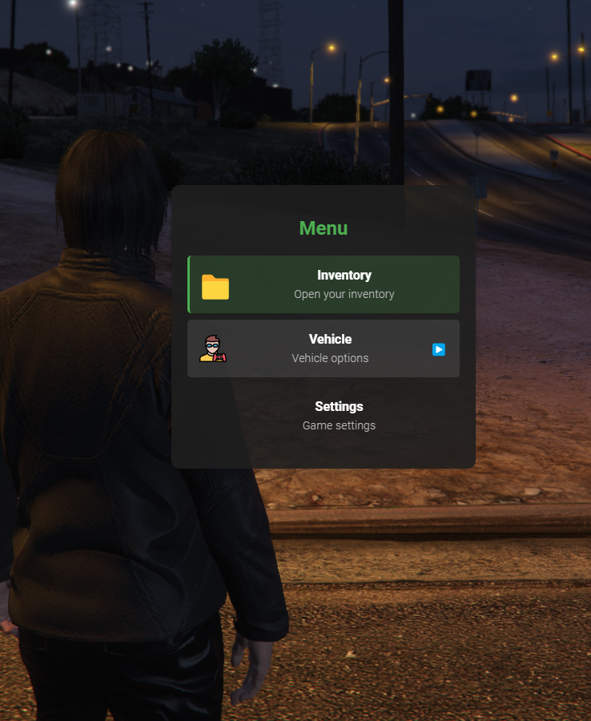
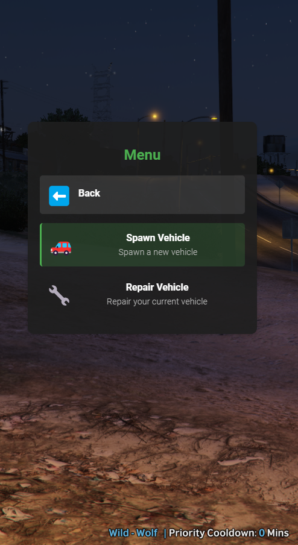
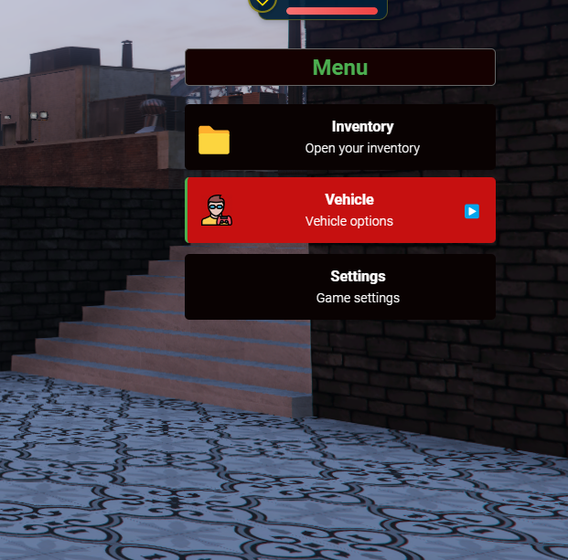

# FiveM Custom Menu System - Documentation


# Screenshots
 
## Main Menu


## Sub Menu


## Main Menu another style



 

## Table of Contents
1. [Introduction](#introduction)
2. [Installation](#installation)
3. [Basic Usage](#basic-usage)
4. [Creating Custom Menus](#creating-wwr_iconMenus)
5. [Advanced Usage](#advanced-usage)
6. [API Reference](#api-reference)
7. [Examples](#examples)
8. [Troubleshooting](#troubleshooting)

## Introduction

This custom menu system provides a modern, flexible, and easy-to-use interface for FiveM scripts. It features a sleek design with smooth animations, keyboard navigation, and support for nested submenus. The system can be easily integrated into other scripts using the exported `OpenMenu` function.

## Installation

1. Copy the `wwr_iconMenu` folder into your FiveM `resources` directory.
2. Ensure your folder structure includes an `html/images` directory for your PNG images.
3. Add `ensure wwr_iconMenu` to your `server.cfg` file.
4. Restart your FiveM server or start the resource manually.

## Basic Usage

To use the menu in your script, you need to import the exported `OpenMenu` function. Here's a basic example:

```lua
-- In your client script
local Menu = exports['wwr_iconMenu']

-- To open the default menu
Menu:OpenMenu()
```

## Creating Custom Menus

You can create custom menus by passing a menu configuration to the `OpenMenu` function. Here's how to structure your menu:

```lua
local myCustomMenu = {
    {
        icon = "🏠",  -- Optional: Use an emoji or leave empty for no icon
        image = "house.png",  -- Optional: Use a PNG image from your 'html/images' folder
        label = "Home",
        description = "Go to your house",
        action = "goHome"
    },
    {
        label = "Vehicles",
        description = "Vehicle options",
        submenu = {
            {
                icon = "🚗",
                label = "Spawn Car",
                description = "Spawn a new car",
                action = "spawnCar"
            },
            {
                icon = "🏍️",
                label = "Spawn Bike",
                description = "Spawn a new bike",
                action = "spawnBike"
            }
        }
    }
}

-- Define your actions
local myMenuActions = {
    goHome = function()
        print("Going home...")
        -- Add your logic here
    end,
    spawnCar = function()
        print("Spawning car...")
        -- Add your car spawning logic here
    end,
    spawnBike = function()
        print("Spawning bike...")
        -- Add your bike spawning logic here
    end
}

-- Open your custom menu
RegisterCommand("openshop", function()

    exports['wwr_iconMenu']:OpenMenu(myCustomMenu, myMenuActions)
end, false)
```

## Advanced Usage

### Menu Item Properties

Each menu item can have the following properties:

- `icon`: An emoji to use as an icon (optional)
- `image`: Filename of a PNG image in your 'html/images' folder (optional)
- `label`: The text displayed for the menu item (required)
- `description`: A brief description of the menu item (optional)
- `action`: A string identifying the action to perform when clicked (optional)
- `submenu`: An array of menu items for a nested submenu (optional)

### Handling Actions

When creating a custom menu, you need to provide an action handler table. This table should contain functions corresponding to the `action` strings in your menu items.

```lua
local myMenuActions = {
    actionName = function()
        -- Your action logic here
    end,
    -- More actions...
}
```

## API Reference

### OpenMenu(menuConfig, actionHandlers)

Opens a custom menu.

- `menuConfig`: A table containing the menu structure (optional, uses default if not provided)
- `actionHandlers`: A table containing action functions (optional, uses default if not provided)

**Usage:**
```lua
exports['wwr_iconMenu']:OpenMenu(myCustomMenu, myMenuActions)
```

## Examples

### Example 1: Simple Custom Menu

```lua
local simpleMenu = {
    {
        icon = "🍔",
        label = "Buy Food",
        description = "Purchase some food",
        action = "buyFood"
    },
    {
        icon = "🍺",
        label = "Buy Drink",
        description = "Purchase a drink",
        action = "buyDrink"
    }
}

local simpleActions = {
    buyFood = function()
        print("Buying food...")
        -- Add your food purchasing logic here
    end,
    buyDrink = function()
        print("Buying drink...")
        -- Add your drink purchasing logic here
    end
}

RegisterCommand("openshop", function()
    exports['wwr_iconMenu']:OpenMenu(simpleMenu, simpleActions)
end, false)
```

### Example 2: Nested Submenus

```lua
local nestedMenu = {
    {
        label = "Vehicles",
        submenu = {
            {
                label = "Cars",
                submenu = {
                    {
                        label = "Sports Car",
                        action = "spawnSportsCar"
                    },
                    {
                        label = "SUV",
                        action = "spawnSUV"
                    }
                }
            },
            {
                label = "Bikes",
                action = "spawnBike"
            }
        }
    },
    {
        label = "Weapons",
        action = "openWeaponShop"
    }
}

local nestedActions = {
    spawnSportsCar = function()
        print("Spawning sports car...")
        -- Add your sports car spawning logic here
    end,
    spawnSUV = function()
        print("Spawning SUV...")
        -- Add your SUV spawning logic here
    end,
    spawnBike = function()
        print("Spawning bike...")
        -- Add your bike spawning logic here
    end,
    openWeaponShop = function()
        print("Opening weapon shop...")
        -- Add your weapon shop logic here
    end
}

RegisterCommand("vehiclemenu", function()
    exports['wwr_iconMenu']:OpenMenu(nestedMenu, nestedActions)
end, false)
```

## Troubleshooting

1. **Menu doesn't open**: Ensure the wwr_iconMenu resource is started and the export is correctly referenced.
2. **Custom actions not working**: Check if the action names in your menu config match the function names in your action handlers.
3. **Images not displaying**: Verify that image files are in the correct location (html/images folder) and that the filenames in your menu config match exactly.
4. **Submenus not working**: Ensure that submenu items are correctly nested in your menu configuration.

For further assistance, please open an issue on the GitHub repository or contact the resource author.
You can also directly contact the resource author on Discord: 
<a href="https://discord.gg/ZZC8JVuyb6" target="_url" >Our Discord</a>